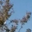
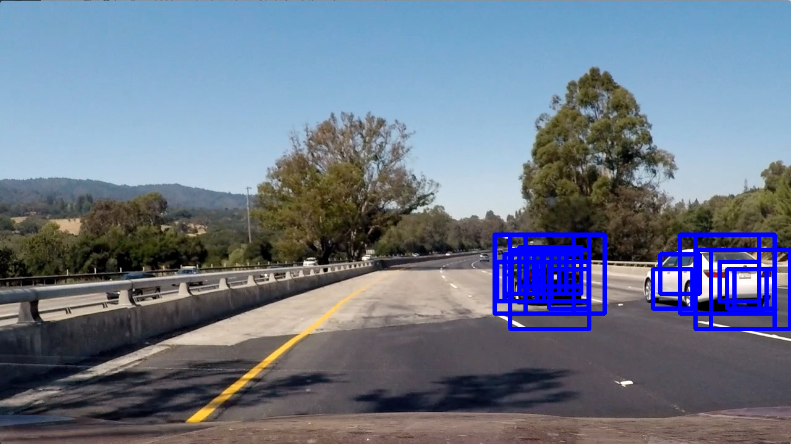

# Vehicle Detection

**Vehicle Detection Project**

The goals / steps of this project are the following:

* Perform a Histogram of Oriented Gradients (HOG) feature extraction on a labeled training set of images and train a classifier Linear SVM classifier
* Optionally, you can also apply a color transform and append binned color features, as well as histograms of color, to your HOG feature vector. 
* Note: for those first two steps don't forget to normalize your features and randomize a selection for training and testing.
* Implement a sliding-window technique and use your trained classifier to search for vehicles in images.
* Run your pipeline on a video stream (start with the test_video.mp4 and later implement on full project_video.mp4) and create a heat map of recurring detections frame by frame to reject outliers and follow detected vehicles.
* Estimate a bounding box for vehicles detected.

## [Rubric](https://review.udacity.com/#!/rubrics/513/view) Points

### Here I will consider the rubric points individually and describe how I addressed each point in my implementation.  

---
### Writeup / README

#### 1. Provide a Writeup / README that includes all the rubric points and how you addressed each one.  You can submit your writeup as markdown or pdf.

This README file serves as the writeup.

### Histogram of Oriented Gradients (HOG)

#### 1. Explain how (and identify where in your code) you extracted HOG features from the training images.

The function for extracting HOG features is in the `UtilFeatures.py` file on line 21.  The function was taken from the class quizes and notes.  At the top of that file on line 8 all of the parameters for the HOG functions are defined.  

For training exploration, I started with the small set of example car and non-car images.

I wrote the `training-workbench.py` file to experiment with the HOG parameters.  In this file you will see the code I used to iterate over many different options for the HOG parameters.  

#### 2. Explain how you settled on your final choice of HOG parameters.

Using my `training-workbench.py` script I generated 4 data sets, each with over 1700 combinations of parameters.  The 4 files were for the spatial features on and off, and the color gradient features on and off.  I then sorted the data by best test scores and looked at the combinations of parameters.  It looked like the LUV, YUV, and YCrCb color spaces always performed very well.  In addition the higher number of orientations for the HOG function resulted in better performance.  The pixels/cell and cells/block were not a large contributor to accuracy.  For the color channel to use, the "ALL" keyword performed the best.  

#### 3. Describe how (and identify where in your code) you trained a classifier using your selected HOG features (and color features if you used them).

In the `UtilClassifiers.py` file on line 16 I define a `CarClassifier` class.  This class is initialized when the program starts, and in the `__init__()` method it will check to see if a set of training parameter files already exist.  If they do, then they will be read in and used for the run.  If not, then the class will use the `train()` method on line 28 to perform the training.

I trained a `sklearn.svm.LinearSVC` classifier for the car classifier.  For training, I used the full car and non-car image sets.  Here are a couple of examples:

With the full dataset, I tuned the parameters a bit more.  The parameters, and the feature extraction are in the `UtilFeatures.py` file described above.  Once the features were extracted for the cars and non-cars, I scaled the inputs using the `sklearn.preprocessing.StandardScaler` and saved the scaler in a class variable for future use.  With scaled inputs, I fit the SVC to the inputs with labels, and stored the resulting SVN in a class variable.  I also saved a pickle file of the SVN and Scaler for later use.  I was seeing accuracy on a 20% testing set of greater than 98%.

### Sliding Window Search

#### 1. Describe how (and identify where in your code) you implemented a sliding window search.  How did you decide what scales to search and how much to overlap windows?

I decided to do 2 different sized search windows.  A larger size (128x128) to cover all of the roadway, and a smaller size (64x64) to cover parts of the road a little further from the car.  Here are some examples:

The code to generate the windows and search them can be found in the `UtilWindows.py` file.  The functions were taken from class quizzes and notes.  

I tried a lot of experiments with the window overlaps and sizes.  At first I had a third layer of windows that were smaller (32x32) but they significantly increased run time and didn't help much in car detection.  I then experimented with various overlaps from 0.5 to 0.8 and settled on 0.8 because more overlap was leading to more car detections.  I wish I had a more rigorous method for sizing the windows and placing them, but after many iterations the windows I settled on do a pretty good job.

#### 2. Show some examples of test images to demonstrate how your pipeline is working.  What did you do to optimize the performance of your classifier?

I ended up the LUV color space, although there were several that would work about as well.  I also ended up with all 3 channels for HOG features.  When I removed spatial parameters and color histograms the accuracy dropped, so I kept both of these methods active.  Here are some examples of boxes found on the test images:

To optimize performance, I tried to keep the number of windows I searched to a minimum.  I tried going down to only 1 HOG color channel, and cutting out the color histograms, but the accuracy dropped too much.  

### Video Implementation

#### 1. Provide a link to your final video output.  Your pipeline should perform reasonably well on the entire project video (somewhat wobbly or unstable bounding boxes are ok as long as you are identifying the vehicles most of the time with minimal false positives.)

Here's a link to my video result:

<a href="./out-project_video.mp4">
 </img>
</a>

#### 2. Describe how (and identify where in your code) you implemented some kind of filter for false positives and some method for combining overlapping bounding boxes.

I wrote a class called `CarDetector` in the `Detectors.py` file.  In the `__init__()` method I initialize the `CarClassifier`, and set up the history and threshold for detection.  In movie processing mode, the method will set up a FIFO deque object with a depth of 25 frames.  Then in the `update()` methon, on line 40 the pipeline calls the `applyHeatmap()` method.  The code will then generate a heat map by adding `1` to any pixels that are contained within a bounding box (search window) found by the classifier.  Once those are set, any areas without at least 2 box overlaps are dropped.  This provides a first line defense against false detections.  

On line 60 and 61 I then sum up the most current 25 frames of heat maps.  This total heap map is then zeroed out on any pixels that do not meet the threshold for keeping.  Once the total heapmap is through the threshold, I then use the `scipy.ndimage.measurements import label` function to label the blobs within the heat map.  On line 76 I use a function found in the class notes to draw bounding boxes around the labeled blobs and return the final answer for that frame.  Here are some images with just the heat maps drawn in the red color channel.

And here are the resulting final bounding boxes from those heat maps:

---

## Discussion

#### 1. Briefly discuss any problems / issues you faced in your implementation of this project.  Where will your pipeline likely fail?  What could you do to make it more robust?

This project was tougher than I thought it would be.  The most difficult obstacle is that the process time for the project move was almost 2 hours.  I ended up clipping out short 1 or 2 second segments of the movie to run as test cases while I would tune the thresholds.  Once everything was working very well, I was getting too many false positives.  It took a lot of trial and error on the thresholds to get rid of them.  I am not really happy with the final result as I ended up raising the thresholds a bit too high and the white car gets lost for a couple seconds.  

If I had more time I would go back and search for more optimized parameters for the classifier and drop the HOG down to 1 color channel.  That would make things much faster.  I would also research the method to do HOG only 1 time per frame instead of for all of the windows.  I'm sure that would make things run much faster.

As it is working now, it takes about 5-6 seconds PER FRAME to process.  So I can't see how this method would actually work in a real-world car, unless it could be done with a good amount of parallelism.  

